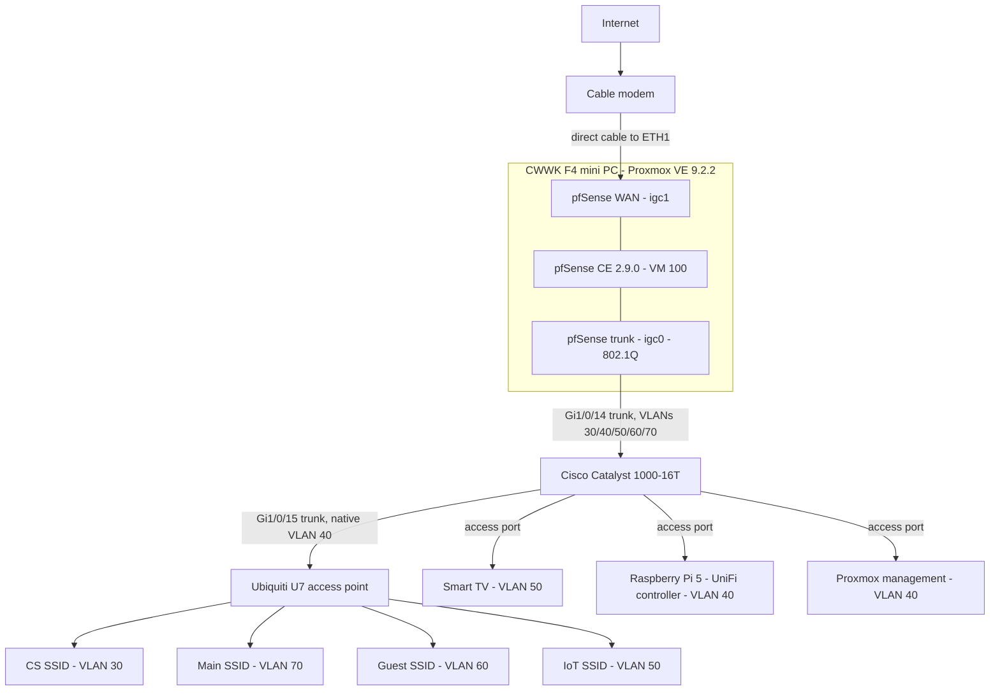

# Segmented Home Network and Security Lab

A production home network rebuilt from the ground up as a segmented, firewalled
environment, with an isolated lab VLAN for security testing. Built on a single
mini PC running Proxmox, with pfSense as the routing and firewall layer, a Cisco
Catalyst switch handling 802.1Q trunking, and a UniFi access point serving four
VLAN-mapped SSIDs.

The consumer router that previously ran the household was removed entirely. All
routing, DHCP, DNS resolution and inter-VLAN policy now runs on infrastructure
configured by hand.

## Why this exists

The goal was not a lab that sits next to a home network. The goal was to replace
the home network with the lab, so that every design decision carried a real cost
if it was wrong. Everyone in the household depends on it working.

That constraint drove most of the choices documented here: the rollback path kept
in place until the new edge was proven, the management plane moved onto its own
VLAN, and a default-deny posture on the lab segment that had to be loosened
deliberately rather than left open by default.

## Topology

## Segment plan

| VLAN | Name | Subnet | Purpose | Wireless |
|---|---|---|---|---|
| 30 | CyberLab | 192.168.30.0/24 | Isolated security lab and target machines | CS SSID |
| 40 | Management | 192.168.40.0/24 | Proxmox, UniFi controller, switch management | None, wired only |
| 50 | IoT | 192.168.50.0/24 | Smart TV and unmanaged embedded devices | IoT SSID |
| 60 | Guest | 192.168.60.0/24 | Visitors, internet only | Guest SSID |
| 70 | Main | 192.168.70.0/24 | Household laptops and phones | Main SSID |

pfSense owns the gateway address on every VLAN and serves DHCP from `.100` to
`.200` on each. The switch does no routing and no DHCP. It tags and forwards.

## Current state

Working and in daily use:

- Five VLANs configured end to end on both pfSense and the Catalyst, saved to NVRAM
- Per-VLAN DHCP and per-interface firewall rule sets
- Four SSIDs mapped to their VLANs through the UniFi controller
- The lab segment blocked from all RFC 1918 space above its pass rule, verified
  by testing rather than assumed
- Consumer router removed from the edge, no double NAT, single point of routing

Open items are tracked at the end of [SECURITY-NOTES.md](SECURITY-NOTES.md).

## Repository map

| File | Contents |
|---|---|
| [ARCHITECTURE.md](ARCHITECTURE.md) | Hardware inventory, port map, addressing, switch and firewall configuration |
| [BUILD-LOG.md](BUILD-LOG.md) | Phase by phase build record, including every failure and how it was diagnosed |
| [SECURITY-NOTES.md](SECURITY-NOTES.md) | Design rationale, threat model, deliberate trade-offs, known gaps |

## Notes on scope

This documents a live environment, so no credentials, key material, account names
or external addresses appear anywhere in this repository. Internal RFC 1918
addressing is included because it is meaningless outside this network and
removing it would make the write-up impossible to follow.
